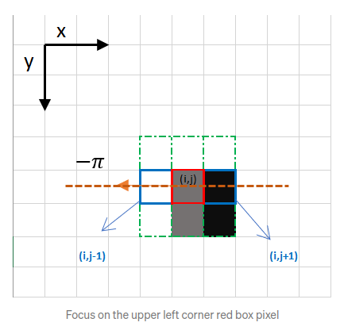

# Esercitazione 3

## 1. Normalizzazione L2 per il filtro gaussiano

Possiamo utilizzare diverse tecniche di normalizzazione per i filtri gaussiani. 
Ognuna di queste normalizzazioni varia nel modo in cui viene calcolato il gradiente.

La norma l^2 (scritta anche "l^2 norm") |x| è una norma vettoriale definita per un vettore complesso

da

Implementate la normalizzazione L2 nella funzione `l2_normalize` che trovate in `filter_image.cpp`. 

## 2. Canny Edge Detector
Il rilevatore di bordi di Canny è un operatore di rilevamento dei bordi che utilizza un algoritmo a più stadi per rilevare un'ampia gamma di bordi nelle immagini.
È stato sviluppato da John F. Canny nel 1986. Canny ha anche prodotto una teoria computazionale del rilevamento dei bordi che spiega perché la tecnica funziona.

L'algoritmo di rilevamento dei bordi di Canny è composto da 5 passi:
1. Riduzione del rumore;
2. Calcolo del gradiente;
3. Non-maximum suppression;
4. Doppia soglia;
5. Tracciamento dei bordi per isteresi.

Dopo aver eseguito tutti i passi, dovreste essere in grado di ottenere il seguente risultato:

Immagine Originale                 |  Immagine Finale
:-----------------:|:------------------:
   |  

Un'ultima cosa importante da menzionare è che l'algoritmo si basa su immagini in scala di grigi. 
Pertanto, il prerequisito è convertire l'immagine in scala di grigi prima di seguire i passaggi sopra menzionati.

Le 5 funzioni da implementare (corrispondenti agli step del Canny Edge Detector) le trovate nel file `edge_detection.cpp`. Cercate di sfruttare le funzioni 
viste nelle esercitazioni precedenti, in particolare nell'Esercitazione 2.

### 2.1 Riduzione del rumore
Un modo per eliminare il rumore sull'immagine è applicare la sfocatura gaussiana per attenuarla. 
Per fare ciò, la tecnica della convoluzione dell'immagine viene applicata con un kernel gaussiano (3x3, 5x5, 7x7 ecc…). 
La dimensione del kernel dipende dall'effetto sfocato previsto. Fondamentalmente, più piccolo è il kernel, 
meno visibile è la sfocatura. 

Dopo aver applicato la sfocatura gaussiana, dovreste ottenere il seguente risultato:

Immagine Originale                 |  Immagine Sfocata
:-----------------:|:------------------:
   |  

### 2.2 Calcolo del gradiente
La fase di calcolo del gradiente rileva l'intensità e la direzione del bordo, calcolando il gradiente dell'immagine
utilizzando gli operatori di rilevamento del bordo.

I bordi corrispondono a una variazione dell'intensità dei pixel. Per rilevarla, il modo più semplice è applicare 
filtri che evidenzino questa variazione di intensità in entrambe le direzioni: orizzontale (x) e verticale (y).

Quando l'immagine è levigata, le derivate Ix e Iy rispetto a x e y vengono calcolate. Ciò può essere implementato 
applicando la convoluzione di I con i kernel Sobel Kx e Ky.

Il risultato è quasi quello previsto, ma possiamo vedere che alcuni bordi sono spessi e altri sottili. Il passaggio di 
soppressione non massima ci aiuterà a mitigare quelli spessi.

Immagine Sfocata                 |  Intensità del Gradiente 
:-----------------:|:------------------:
   |  

### 2.3 Non-maximum suppression
Idealmente, l'immagine finale dovrebbe avere bordi sottili. Pertanto, dobbiamo eseguire una soppressione 
non massima per assottigliare i bordi.

Il principio è semplice: l'algoritmo passa attraverso tutti i punti della matrice di intensità del gradiente 
e trova i pixel con il valore massimo nelle direzioni dei bordi.

Facciamo un semplice esempio:

Il riquadro rosso in alto a sinistra presente nell'immagine sopra, rappresenta un pixel di intensità 
della matrice dell'Intensità del gradiente in elaborazione. La direzione del bordo corrispondente è 
rappresentata dalla freccia arancione con un angolo di -pi radianti (+/-180 gradi).

La direzione del bordo è la linea tratteggiata arancione (orizzontale da sinistra a destra). Lo scopo 
dell'algoritmo è verificare se i pixel nella stessa direzione sono più o meno intensi di quelli in 
elaborazione. Nell'esempio sopra, il pixel (i, j) viene elaborato e i pixel nella stessa direzione sono 
evidenziati in blu (i, j-1) e (i, j+1). Se uno di questi due pixel è più intenso di quello in 
elaborazione, viene mantenuto solo quello più intenso. Il pixel (i, j-1) sembra essere più intenso, 
perché è bianco. Quindi, il valore di intensità del pixel corrente (i, j) è impostato su 0. 
Se non ci sono pixel nella direzione del bordo con valori più intensi, il valore del pixel corrente 
viene mantenuto.

Concentriamoci ora su un altro esempio:

In questo caso la direzione è la linea diagonale tratteggiata arancione. Pertanto, il pixel più intenso 
in questa direzione è il pixel (i-1, j+1).

Il risultato è la stessa immagine con bordi più sottili. Possiamo tuttavia notare ancora qualche 
variazione per quanto riguarda l'intensità dei bordi: alcuni pixel sembrano essere più luminosi di altri, 
e cercheremo di colmare questa mancanza con i due passaggi finali.

Intensità del Gradiente                 |  Non-Max Suppression
:-----------------:|:------------------:
   |  

### 2.4 Doppia soglia
Il passaggio a doppia soglia mira a identificare 3 tipi di pixel: forti, deboli e non rilevanti:
- I pixel forti sono pixel che hanno un'intensità così alta che siamo sicuri che contribuiscano al bordo finale.
- I pixel deboli sono pixel che hanno un valore di intensità che non è sufficiente per essere considerati forti, ma non abbastanza piccolo per essere considerato non rilevante per il rilevamento dei bordi.
- Altri pixel sono considerati non rilevanti per il bordo.

Ora puoi vedere a cosa servono le doppie soglie:

- La soglia alta viene utilizzata per identificare i pixel forti (intensità superiore alla soglia alta)
- La soglia bassa viene utilizzata per identificare i pixel non rilevanti (intensità inferiore alla soglia bassa)
- Tutti i pixel con intensità tra entrambe le soglie sono contrassegnati come deboli e il meccanismo di isteresi (passaggio successivo) ci aiuterà a identificare quelli che potrebbero essere considerati forti e quelli che sono considerati non rilevanti.

Il risultato di questo passaggio è un'immagine con valori di intensità di soli 2 pixel (forte e debole):

Non-Max Suppression                 |  Doppia soglia
:-----------------:|:------------------:
   |  

### 2.5 Tracciamento dei bordi per isteresi

In base ai risultati di soglia, l'isteresi consiste nel trasformare pixel deboli in pixel forti, 
se e solo se almeno uno dei pixel attorno a quello in elaborazione è forte, come di seguito descritto:

Il risultato finale dovrebbe essere:

Doppia Soglia                 |  Isteresi
:-----------------:|:------------------:
   |  

## 3. Lane Detector
In questa sezione implementeremo una semplice applicazione di rilevamento della corsia utilizzando 
il rilevatore di bordi Canny e la trasformata di Hough. Ecco alcune immagini di esempio di come apparirà 
il tuo rilevatore di corsia finale.

L'algoritmo può essere suddiviso nei seguenti passaggi:

1. Rileva i bordi usando il rilevatore di bordi Canny.
2. Estrarre i bordi nella regione di interesse (un triangolo che copre gli angoli inferiori e il centro dell'immagine).
3. Esegui la trasformazione di Hough per rilevare le corsie.

### 3.1 Rilevamento dei bordi
Le corsie sulle strade sono generalmente sottili e lunghe con colori vivaci. Il nostro algoritmo di 
rilevamento dei bordi da solo dovrebbe essere in grado di trovare le corsie abbastanza bene. Esegui la 
cella di codice seguente per caricare l'immagine di esempio e rilevare i bordi dall'immagine.

### 3.2 Estrazione dei punti di interesse (ROI)
Potrete vedere che il rilevatore di bordi Canny troverà i bordi delle corsie. Tuttavia, noterete 
verranno identificati anche bordi di altri oggetti che non ci interessano. Data la posizione e 
l'orientamento della telecamera, sappiamo che le corsie si troveranno nella metà inferiore dell'immagine.

### 3.3 Trasformazione di Hough 
[Qui](https://web.ipac.caltech.edu/staff/fmasci/home/astro_refs/HoughTrans_lines_09.pdf) trovate alcune note per implementare la trasformazione di Hough.